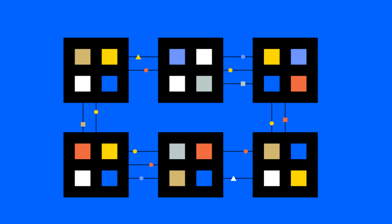

### [Home](../README.md) | [Next](../ethereum/index.md)

# Blockchain Basics

Blockchains are complex. The technology that makes them work is a result of
decades of innovation across several disciplines. To understand how we got to
where we are today, there needs to be some basic understanding of the
underlying concepts. These articles are meant to be a relatively high level
overview of the core concepts, and most are part of larger hubs of articles in
the event you need to dive deeper into a specific topic.

Geeks for Geeks has a few sets of articles that are good starting points. This
will give a background in how to understand the way blockchain tech works. Learn
[a basic understanding of computer networking](https://www.geeksforgeeks.org/basics-computer-networking/#) (30 min)

This full hub of articles is worth going through at some point. The goal for now
is to just learn some of the common terminology and reading the main intro
article is sufficient. Everything on the blockchain is handled through
networking distributed nodes, and having some understanding of computer
networking is essential.

[What is Peer to Peer Process](https://www.geeksforgeeks.org/what-is-p2p-peer-to-peer-process/) (20 min)

The specific type of network that a blockchain runs on is Peer to Peer. This is
from the blockchain knowledge series on Geeks for Geeks, which again is worth
diving into fully at some point.

[Blockchain Cryptography](https://www.geeksforgeeks.org/cryptography-in-blockchain/) (20 min)

Blockchain networks only function through effective cryptography. The use of asymmetric keys and hashing is a core concept and referred to frequently throughout the Ethereum and Base documentation.

(Optional) [Tree Data structure](https://www.geeksforgeeks.org/introduction-to-tree-data-structure-and-algorithm-tutorials)
(30 min+)

The core data structures used to store the blockchain data is built on types of tree data structures called tries. This is helpful from a deeper Computer Science background, but is not necessary to go deeper.

[What is Blockchain Technology?](https://www.coindesk.com/learn/what-is-blockchain-technology/) (5 min)

This is a very high-level overview of blockchain as a concept. It helps pull together some of the things mentioned in the above fundamentals.

Finally a worthwhile read is the [Bitcoin whitepaper](https://bitcoin.org/bitcoin.pdf) (30 min).
Bitcoin was the first cryptocurrency to launch as a functioning, decentralized blockchain. This article is significant as nothing that we are working towards now with Base would exist without Bitcoin.
