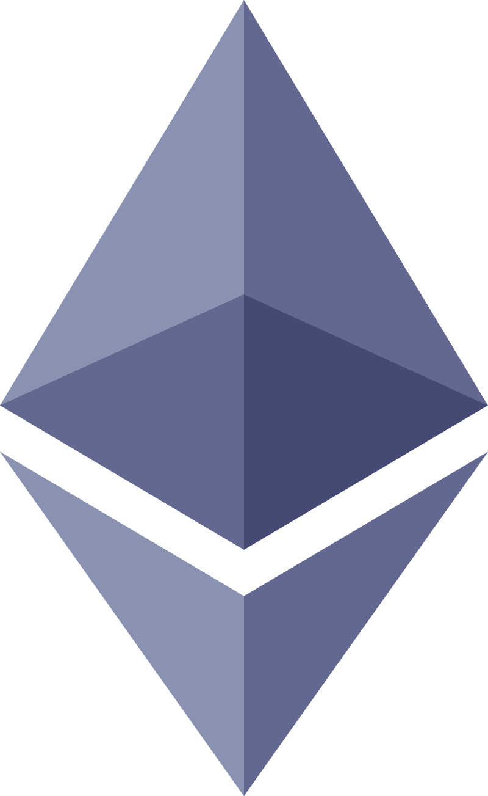

### [Home](../README.md) | [Previous](../blockchain-basics/index.md) | [Next](../solidity/index.md)

# Ethereum

Base is a layer 2 (L2) blockchain network built on top of Ethereum. In order to
understand how the L2 rollup works, you need to have a good understanding of how
Ethereum works.

To start you should read the original [Ethereum whitepaper](https://ethereum.org/en/whitepaper/). A lot of the
technology behind Ethereum has changed since then (most significantly the move
to full Proof of Stake after the merge), but many of the core pieces of Ethereum
as a computational platform are explained here. (1 hour)

Base Camp (the Base developer guide) has a good [Intro video on Ethereum](https://docs.base.org/base-camp/docs/introduction-to-ethereum/intro-to-ethereum-vid/) (8 min)

The Ethereum Foundation maintains a set of articles around the core functionality of Ethereum. These are all core readings to understand the protocol. Most of these articles are short and should take roughly 5 - 10 min each.

| Title                                                                                             | Description                                                                                                 |
| ------------------------------------------------------------------------------------------------- | ----------------------------------------------------------------------------------------------------------- |
| [Intro to Ethereum](https://ethereum.org/en/developers/docs/intro-to-ethereum/)                   | Introduction to the Ethereum Blockchain                                                                     |
| [Intro to Ether](https://ethereum.org/en/developers/docs/intro-to-ether/)                         | Introduction to Ether Cryptocurrency                                                                        |
| [Introduction to Dapps](https://ethereum.org/en/developers/docs/dapps/)                           | Introduction to Decentralized Applications                                                                  |
| [Web2 vs Web3](https://ethereum.org/en/developers/docs/web2-vs-web3/)                             | The differences between Web2 and Web3                                                                       |
| [Ethereum Accounts](https://ethereum.org/en/developers/docs/accounts/)                            | How Accounts work on Ethereum                                                                               |
| [Transactions](https://ethereum.org/en/developers/docs/transactions/)                             | What makes an Ethereum Transaction and how they work                                                        |
| [Blocks](https://ethereum.org/en/developers/docs/blocks/)                                         | How Ethereum state organizes into Blocks                                                                    |
| [EVM (skip Opcodes)](https://ethereum.org/en/developers/docs/evm/)                                | How the Ethereum Virtual Machine powers computation in the protocol                                         |
| [Gas](https://ethereum.org/en/developers/docs/gas/)                                               | How gas is used as fees in the network                                                                      |
| [Nodes and Clients](https://ethereum.org/en/developers/docs/nodes-and-clients/)                   | Overview of Ethereum Nodes and the clients used to run them                                                 |
| [Client Diversity](https://ethereum.org/en/developers/docs/nodes-and-clients/client-diversity/)   | Why there are multiple clients for running Ethereum                                                         |
| [Node Architecture](https://ethereum.org/en/developers/docs/nodes-and-clients/node-architecture/) | The software architecture of an Ethereum node between the consensus and execution clients                   |
| [Networks](https://ethereum.org/en/developers/docs/networks/)                                     | Overview of the different Ethereum networks                                                                 |
| [Consensus Mechanisms](https://ethereum.org/en/developers/docs/consensus-mechanisms/)             | High level overview of how consensus works                                                                  |
| [Proof of Work](https://ethereum.org/en/developers/docs/consensus-mechanisms/pow/)                | Covers how Ethereum consensus worked pre-Merge                                                              |
| [Proof of Stake](https://ethereum.org/en/developers/docs/consensus-mechanisms/pos/)               | Covers how Ethereum consensus currently works                                                               |
| [Standards](https://ethereum.org/en/developers/docs/standards/)                                   | This covers EIPs and how Ethereum upgrades itself as well as the token standards that have been implemented |

Finish remaining [Introduction to Ethereum](https://docs.base.org/base-camp/docs/introduction-to-ethereum/ethereum-dev-overview-vid) Section on Base Camp
(excluding the Guide to Base) (30 min)

To understand where Ethereum is headed, [this graphic](https://github.com/dcbuild3r/blockchain-development-guide/blob/main/images/ethereum_roadmap.png) covers all the changes that have happened and are coming to the protocol
