# Introduction

[EIP-6551](https://eips.ethereum.org/EIPS/eip-6551) enhances the features of NFTs (ERC-721 tokens) by giving each token its own smart contract account, also known as token-bound accounts (TBA). These smart contract accounts equip NFTs with the ability to operate like traditional blockchain wallets, allowing state changes and features such as holding ERC-20 tokens, other NFTs, and ether. Programmable accounts open up a myriad of use cases, limited only by the developer's imagination and the protocol's constraints.

Importantly, EIP-6551 is backwards compatible and doesn't mandate custom logic within the NFT smart contract. This compatibility allows NFT projects that were created before the introduction of EIP-6551 to adopt smart contract accounts via a [permissionless registry](https://eips.ethereum.org/EIPS/eip-6551#registry).

# Use cases for token bound accounts:

- **Gaming** - A character, represented as an NFT, can possess its own inventory (like weapons, gold, etc.) using a smart wallet
- **Investing** - Utilize NFTs and their smart contract accounts to organize assets and sell entire investment portfolios in a single transaction
- **Social (DAOs)** - NFTs representing DAO membership can now maintain their own transaction history

# Create an NFT with a Token Bound Account

This guide demonstrates how to create and interact with three smart contracts:

1. An [ERC-721](https://docs.openzeppelin.com/contracts/4.x/erc721) smart contract that serves as our NFT.
2. A [registry contract](https://eips.ethereum.org/EIPS/eip-6551) that deploys smart contract account associated with a given ERC-721 and computes the token bound account address.
3. A token bound account contract that can send and receive ether and other ERC-20 tokens.

# Tools

We will use a few tools to write and deploy our smart contracts:

| Tool                                                   | Description                                                                    |
| ------------------------------------------------------ | ------------------------------------------------------------------------------ |
| [Hardhat](https://hardhat.org/)                        | Helps deploy and interact with smart contracts                                 |
| [Node.js](https://nodejs.org/en)                       | Developer environment                                                          |
| [OpenZeppelin](https://www.openzeppelin.com/contracts) | An open library for building secure smart contracts                            |
| [Coinbase Wallet](https://www.coinbase.com/wallet/)    | Non-custodial wallet for creating accounts and interacting with the blockchain |

# Getting started

We will be deploying these smart contracts on the [Base](https://docs.base.org/) Goerli testnet allowing us to see transaction information on [BaseScan](https://goerli.basescan.org/).

Using a testnet requires us to obtain testnet funds from a [faucet](https://coinbase.com/faucets) to deploy and interact with our smart contracts on that network.

## Configure Coinbase Wallet for testnet interactions

_**Warning**: This demo requires the use of private keys in order to effectively interact with the blockchain. For this demo, use newly created wallets as a safety measure._

_Depending on system settings your wallet may look different_

**Open the Coinbase Wallet browser extention then click on the Settings tab**

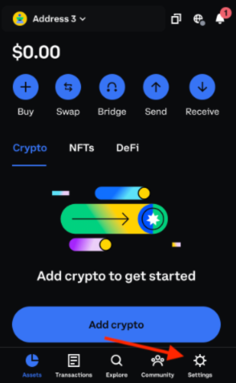

**Select "Developer Settings"**

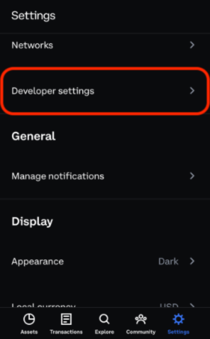

#### Toggle "Testnets" on

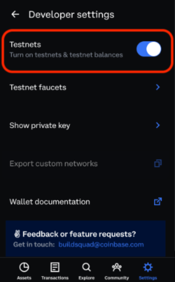

## Request Testnet Funds

**Click on the Settings tab**


**Select "Networks"**

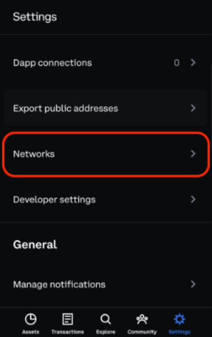

**Select "Testnets" tab**

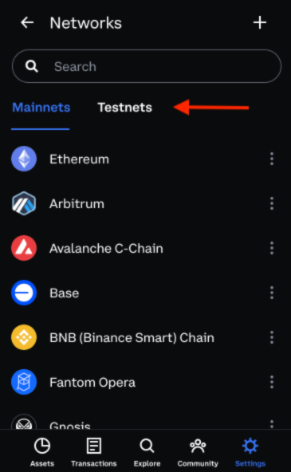

**Click on the water (💧) icon**

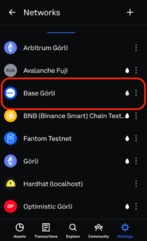

**Request testnet funds**

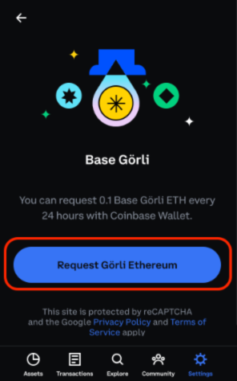

Alternatively, use the [base faucet](https://coinbase.com/faucets/base-ethereum-goerli-faucet)

## Environment Setup

**Clone this repo**

```bash
git clone https://github.com/base-org/guides.git
```

**Change into the directory**

```bash
cd base-guides/6551
```

**Initiate a node project and install dependencies:**

The dependencies in this project are as follows:

| Dependencies                                                                                  | Description                                                                                               |
| --------------------------------------------------------------------------------------------- | --------------------------------------------------------------------------------------------------------- |
| [hardhat](https://hardhat.org/)                                                               | Helps deploy and interact with smart contracts                                                            |
| [hardhat-toolbox](https://hardhat.org/hardhat-runner/plugins/nomicfoundation-hardhat-toolbox) | Bundles all the commonly used packages and Hardhat plugins we recommend to start developing with Hardhat. |
| [dot-env](https://www.npmjs.com/package/dotenv)                                               | Dotenv is a zero-dependency module that loads environment variables from a .env file into process.env     |
| [openzeppelin/contracts](https://www.npmjs.com/package/@openzeppelin/contracts)               | A library for secure smart contract development.                                                          |

**Install them by running:**

```bash
npm install
```

# Wallet setup

Assuming you have set up your wallet (and safely stored away your seed phrase) and have some funds (testnet or mainnet), obtain the addresses and private keys needed for the demo.

## Copy your private key

_Do not share your private key with anyone._

**Click on the Settings tab**


**Select "Developer Settings"**


**Click on "Show private key"**

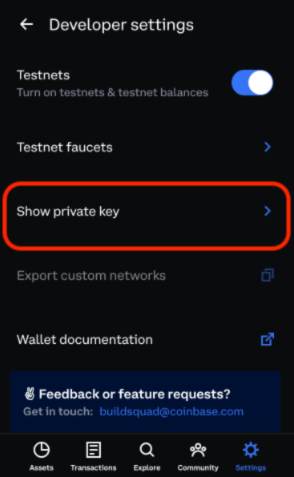

**Enter password**

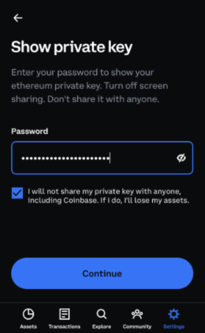

**Read disclaimer to copy address**

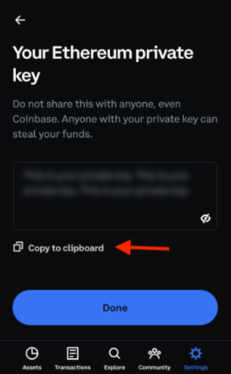

**Type the following command into your terminal application**:

```bash
export WALLET_KEY=
```

**Paste the private key after `export WALLET_KEY= `within your terminal**

Your terminal should look like this

```bash
export WALLET_KEY=0xde9be858da4a475276426320d5e9262ecfc3ba460bfac56360bfa6c4c28b4ee0
```

Press enter/return on your keyboard to save the value

**Verify your private key have been saved:**

```bash
echo $WALLET_KEY
```

**Sameple output:**

```bash
0xde9be858da4a475276426320d5e9262ecfc3ba460bfac56360bfa6c4c28b4ee0
```

## Obtain details of another account

_Note: Each account will need funds in order to deploy contracts and interact with Base._

**From the assets tab, click on the current address/account**

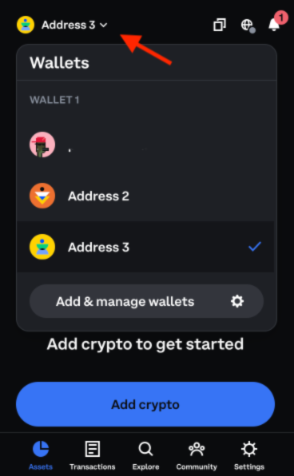

**Select another wallet/account**

If you do not have a additional accounts click the "Add & managege wallets" button to create a new account.

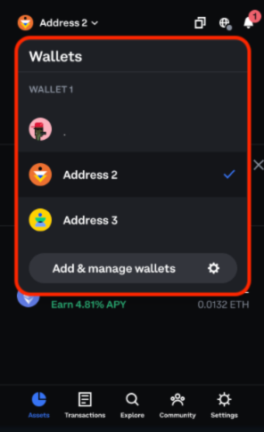

**Copy the address of the newly selected account**

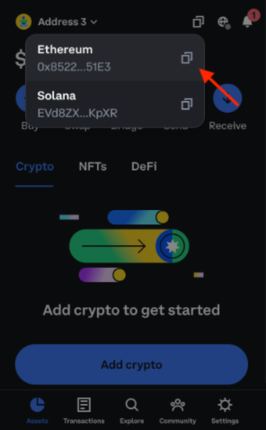

**Type the following command into your terminal application**

Your terminal should look like this:

```bash
export WALLET2_ADDR=
```

**Paste the address as an environment varible with in your terminal**

```bash
export WALLET2_ADDR=0xf39Fd6e51aad88F6F4ce6aB8827279cffFb92266
```

Press enter/return on your keyboard to save the value

**Verify the account address has been saved:**

```bash
echo $WALLET2_ADDR
```

**Sameple output:**

```bash
0xf39Fd6e51aad88F6F4ce6aB8827279cffFb92266
```

**Save the private key of the currently selected account**

Each account has it's own private key.

This wallet will be the original owner of the NFT minted later in this tutorial. You will need the private key of the currently selected wallet in order to transfer the ownership of the NFT.

Refer to the [previous steps](#copy-your-private-key) for obtaining and copying your private keys and save them as an environment varible `WALLET2_KEY ` using your terminal.

Example:

```bash
export WALLET2_KEY=0x5de4111afa1a4b94908f83103eb1f1706367c2e68ca870fc3fb9a804cdab365a
```

**Verify your private key has been saved:**

```bash
echo $WALLET2_KEY
```

**Sample output:**

```bash
0x5de4111afa1a4b94908f83103eb1f1706367c2e68ca870fc3fb9a804cdab365a
```

## Deploy contracts on the Base testnet

The following script will deploy three smart contracts and save their deployment information in a file called `deploymentData.json`.

Once you become comfortable deploying contracts on a testnet, you may deploy contracts on the Base mainnet by replacing `--network base-goerli ` with `--network base-mainnet` .

```
npx hardhat run scripts/01_deploy_contracts.js --network base-goerli
```

### Sample output:

```bash
ERC-721 Contract deployed at: 0xECD4b1C01a0aF70C7Ee985db389E294D01DffEC0
Saved deployment data to a new file: deploymentData.json
Deployed registry contract at: 0x58B2EAe6f05abf9C1e1566AD9307C67B41627A1e
```

```bash
[
  {
  NftContract: {
  address: '0xECD4b1C01a0aF70C7Ee985db389E294D01DffEC0',
  deployer: '0xB6d00D83158feE6695C72ff9c5E915478A465724',
  deploymentHash: '0xedacc11c5268b155a9a6918b5e1cc19031343f41519f596eb264ef6ca3feaeb4'
  }
  },
  {
  ERC6551Registry: {
  address: '0x58B2EAe6f05abf9C1e1566AD9307C67B41627A1e',
  deployer: '0xB6d00D83158feE6695C72ff9c5E915478A465724',
  deploymentHash: '0xcf45022f97e682eccc87c903c6eff38ba2c080aeb69c69da4662914aacf4f481'
  }
  }
]
```

```bash
  Deployment data saved to: deploymentData.json
  Deploying Token Bound Account
  Token bound account deployed at: 0xdAcaEDF79Fa33405446F2B9Fbf820Cef84507f22
```

```bash
[
  {
    NftContract: {
    address: '0xECD4b1C01a0aF70C7Ee985db389E294D01DffEC0',
    deployer: '0xB6d00D83158feE6695C72ff9c5E915478A465724',
    deploymentHash: '0xedacc11c5268b155a9a6918b5e1cc19031343f41519f596eb264ef6ca3feaeb4'
    }
  },
  {
    ERC6551Registry: {
    address: '0x58B2EAe6f05abf9C1e1566AD9307C67B41627A1e',
    deployer: '0xB6d00D83158feE6695C72ff9c5E915478A465724',
    deploymentHash: '0xcf45022f97e682eccc87c903c6eff38ba2c080aeb69c69da4662914aacf4f481'
    }
  },
    {
    ERC6551Account: {
    address: '0xdAcaEDF79Fa33405446F2B9Fbf820Cef84507f22',
    deployer: '0xB6d00D83158feE6695C72ff9c5E915478A465724',
    deploymentHash: '0xbfe9ab08951e07660c2d3a6e9b16e6e959a174530f1e28aba9c98a19c381f586'
    }
  }
]
```

```bash
Deployment data saved to: deploymentData.json
```

This script will mint an NFT and assign its ownership to the `WALLET2_ADDR` account

```bash
npx hardhat run scripts/02_mint_nft.js --network --network base-goerli
```

### Sample output:

```bash
0xECD4b1C01a0aF70C7Ee985db389E294D01DffEC0
Minting NFT...
TokenId 0 is owned by address: 0x9eEd71442F60440b39Def927047e5823c0b208D4
```

This script will create and compute the address for a smart contract wallet (token bound account)

```bash
npx hardhat run scripts/03_create_account.js --network base-goerli
```

### Sample output:

```
Computed Address: 0xA5153E5D9A384e519fEa64D228797edb4a448d45
```

This script will send funds from `WALLET_KEY` to the token bound account and transfer ownership of the NFT from `WALLET2_ADDR` to `WALLET_KEY`.

```bash
npx hardhat run scripts/04_account_interaction.js --network base-goerli
```

### Sample output:

```
Current owner of tokenId 0 is 0x9eEd71442F60440b39Def927047e5823c0b208D4
Token account has 0 ETH
New owner of tokenId 0 is 0xB6d00D83158feE6695C72ff9c5E915478A465724
Token account has 12500000000000000 ETH
```

# Congrats!

Clear the private keys from your environment variables by runnning this command:

```bash
export WALLET_KEY=nil
export WALLET2_KEY=nil
```
